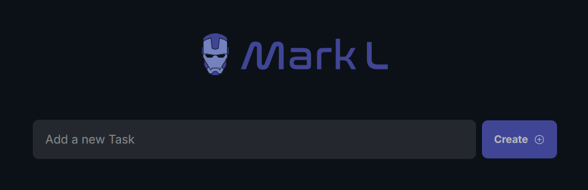

# 🚀 Playwright eXpress

<!-- ====================================================== -->
<!-- BANNER DO PROJETO -->
<!-- ====================================================== -->

<p align="center">
  
</p>

<p align="center">

Projeto de automação E2E desenvolvido com <strong>Playwright + TypeScript</strong> utilizando uma aplicação real de gerenciamento de tarefas.

</p>

---

# 📌 Índice

- [Sobre o projeto](#-sobre-o-projeto)
- [Tecnologias utilizadas](#-tecnologias-utilizadas)
- [Demonstração](#-demonstração)
- [Estrutura do projeto](#-estrutura-do-projeto)
- [Arquivos importantes](#-arquivos-importantes)
- [Conceitos aplicados](#-conceitos-aplicados)
- [Instalação completa](#-instalação-completa)
- [Configuração do ambiente](#-configuração-do-ambiente)
- [Executando aplicação](#-executando-aplicação)
- [Executando os testes](#-executando-os-testes)
- [Relatórios](#-relatórios)
- [GitHub Actions](#-github-actions)
- [Boas práticas](#-boas-práticas-aplicadas)
- [Autor](#-autor)

---

# 📖 Sobre o projeto

O Playwright eXpress é um projeto de automação End-to-End criado para praticar conceitos modernos de automação utilizando Playwright na aplicação Mark L.

O foco principal do projeto foi construir uma estrutura organizada, reutilizável e próxima de ambientes reais de automação profissional.

Durante o desenvolvimento foram aplicados conceitos como:

- Page Object Model (POM)
- Integração entre UI e API
- Massa de teste com JSON
- Helpers reutilizáveis
- Fixtures
- TypeScript
- GitHub Actions
- Relatórios automatizados
- Testes independentes
- Estrutura escalável

---

# 🛠 Tecnologias utilizadas

<details>
<summary><strong>Visualizar tecnologias</strong></summary>

<br>

## Automação

- Playwright
- TypeScript
- Node.js
- Yarn
- Dotenv

## Backend e ambiente

- API REST
- SQLite
- Git
- GitHub Actions

</details>

---


# 📁 Estrutura do projeto

<details>
<summary><strong>Visualizar estrutura completa</strong></summary>

<br>

```bash
playwright-mark
│
├── .github
│   └── workflows
│       └── playwright.yml
│
├── apps
│   ├── api
│   └── web
│
├── tests
│   ├── fixtures
│   │   ├── task.model.ts
│   │   └── tasks.json
│   │
│   ├── support
│   │   ├── helpers.ts
│   │   └── pages
│   │       └── tasks
│   │           └── index.ts
│   │
│   ├── home.spec.ts
│   └── tasks.spec.ts
│
├── playwright.config.ts
├── package.json
└── .env
```

</details>

---

# 🔗 Arquivos importantes

<details>
<summary><strong>Helpers</strong></summary>

<br>

Os helpers foram utilizados para centralizar comportamentos reutilizáveis compartilhados entre diferentes cenários da automação.

Essa abordagem reduz duplicação de código e facilita manutenção da suíte, principalmente em fluxos de preparação e limpeza de ambiente.

📄 [`tests/support/helpers.ts`](./tests/support/helpers.ts)

</details>

---

<details>
<summary><strong>Fixtures</strong></summary>

<br>

As fixtures foram utilizadas para modelar e tipar as massas de teste utilizando TypeScript.

Isso melhora previsibilidade dos cenários, reduz erros relacionados à estrutura dos dados e facilita manutenção da automação.

📄 [`tests/fixtures/task.model.ts`](./tests/fixtures/task.model.ts)

📄 [`tests/fixtures/tasks.json`](./tests/fixtures/tasks.json)

</details>

---

<details>
<summary><strong>Page Objects</strong></summary>

<br>

Os Page Objects foram utilizados para desacoplar as interações da interface da lógica dos cenários automatizados.

Essa estratégia reduz impacto de alterações visuais da aplicação nos testes automatizados, além de melhorar reutilização, organização e legibilidade da suíte.

📄 [`tests/support/pages/tasks/index.ts`](./tests/support/pages/tasks/index.ts)

</details>

---

<details>
<summary><strong>Arquivos de teste</strong></summary>

<br>

Os arquivos `.spec.ts` concentram os cenários automatizados da aplicação e utilizam a estrutura baseada em Page Objects, helpers e fixtures para manter os testes organizados e independentes.

📄 [`tests/tasks.spec.ts`](./tests/tasks.spec.ts)

📄 [`tests/home.spec.ts`](./tests/home.spec.ts)

</details>

---

<details>
<summary><strong>Workflow CI/CD</strong></summary>

<br>

Pipeline automatizada utilizando GitHub Actions.

📄 [`.github/workflows/playwright.yml`](./.github/workflows/playwright.yml)

</details>

---

# 🧠 Conceitos aplicados

<details>
<summary><strong>Page Object Model (POM)</strong></summary>

<br>

O padrão Page Object Model (POM) foi utilizado para separar as regras de interação da interface da lógica dos cenários automatizados.

Com isso, alterações visuais da aplicação impactam menos os testes, além de melhorar manutenção, reutilização e legibilidade da automação.

## Benefícios

- reutilização de código
- separação de responsabilidades
- manutenção simplificada
- melhor organização da suíte
- cenários mais legíveis

## Exemplo

```ts
async create(task: TaskModel) {

    await this.inputTaskName.fill(task.name)

    await this.page.click(
        'css=button >> text=Create'
    )
}
```

</details>

---

<details>
<summary><strong>Fixtures</strong></summary>

<br>

As fixtures foram utilizadas para garantir tipagem forte das massas de teste utilizando TypeScript.

Essa abordagem melhora previsibilidade dos cenários, reduz inconsistência de dados e facilita manutenção da automação.

## Exemplo

```ts
export interface TaskModel {
    name: string
    is_done: boolean
}
```

## Benefícios

- tipagem forte
- previsibilidade
- melhor manutenção
- redução de erros

</details>

---

<details>
<summary><strong>Massa de testes com JSON</strong></summary>

<br>

A massa de testes foi centralizada em arquivos JSON para desacoplar os dados da lógica dos cenários automatizados.

Inicialmente foram utilizados dados dinâmicos com Faker, porém posteriormente a estratégia foi alterada para massa fixa utilizando JSON, buscando maior previsibilidade, estabilidade e legibilidade da suíte.

## Exemplo

```json
{
  "success": {
    "name": "Ler um livro de typescript",
    "is_done": false
  }
}
```

## Benefícios

- reutilização de dados
- separação da massa de teste
- cenários mais organizados
- manutenção simplificada
- maior estabilidade

</details>

---

<details>
<summary><strong>Integração entre UI e API</strong></summary>

<br>

A integração entre API e interface foi utilizada para preparação e limpeza de dados antes da execução dos cenários automatizados.

Essa estratégia reduz dependência da interface para setup dos testes, melhora performance da suíte e aumenta estabilidade das execuções.

## Exemplo

```ts
await deleteTaskByHelper(request, task.name)
await postTask(request, task)
```

## Benefícios

- testes independentes
- menor flakiness
- melhor performance
- maior confiabilidade
- preparação rápida de ambiente

</details>

---

# 🎯 Estratégias utilizadas

<details>
<summary><strong>Testes independentes</strong></summary>

<br>

Os cenários foram construídos para serem independentes entre si.

Cada teste prepara sua própria massa utilizando integração com API, evitando dependência de execuções anteriores.

Essa abordagem reduz efeitos cascata e aumenta confiabilidade da suíte automatizada.

</details>

---

<details>
<summary><strong>Estratégia de massa de teste</strong></summary>

<br>

Durante o desenvolvimento foram utilizadas duas estratégias de massa:

## Massa dinâmica

Inicialmente foram utilizados dados dinâmicos com Faker para geração aleatória de informações durante os testes.

## Massa fixa

Posteriormente a estratégia foi alterada para massa fixa via JSON, visando maior previsibilidade, estabilidade e facilidade de manutenção.

Essa abordagem tornou os cenários mais legíveis e reduziu inconsistências durante as execuções.

</details>

---

<details>
<summary><strong>Estratégia de localização de elementos</strong></summary>

<br>

Os seletores foram construídos priorizando estabilidade e legibilidade, evitando dependência excessiva de estruturas visuais mais frágeis.

Durante o projeto foram utilizadas estratégias como:

- CSS Selectors
- XPath
- Text Selectors
- IDs
- Placeholders

O objetivo foi praticar diferentes abordagens de localização e compreender impactos de manutenção e estabilidade em cada estratégia.

</details>

---

# ⚙ Instalação completa

<details>
<summary><strong>1. Instalar Node.js</strong></summary>

<br>

O projeto utiliza Node.js como ambiente de execução do Playwright e TypeScript.

Download:

🔗 https://nodejs.org

Versões recomendadas:

- Node.js 18+
- Node.js 20+

Verificar instalação:

```bash
node -v
```

Verificar npm:

```bash
npm -v
```

</details>

---

<details>
<summary><strong>2. Instalar Git</strong></summary>

<br>

Download:

🔗 https://git-scm.com/downloads

Verificar instalação:

```bash
git --version
```

</details>

---

<details>
<summary><strong>3. Habilitar Corepack</strong></summary>

<br>

O Corepack auxilia no gerenciamento do Yarn.

```bash
corepack enable
```

</details>

---

<details>
<summary><strong>4. Instalar Yarn</strong></summary>

<br>

Instalação:

```bash
npm install -g yarn
```

Verificar instalação:

```bash
yarn -v
```

</details>

---

<details>
<summary><strong>5. Criar pasta do projeto</strong></summary>

<br>

```bash
mkdir playwright-mark
```

Entrar na pasta:

```bash
cd playwright-mark
```

</details>

---

<details>
<summary><strong>6. Inicializar projeto Node</strong></summary>

<br>

```bash
yarn init -y
```

Isso criará o arquivo:

```bash
package.json
```

</details>

---

<details>
<summary><strong>7. Instalar Playwright</strong></summary>

<br>

O Playwright é o framework principal utilizado para automação E2E da aplicação.

Instalação completa:

```bash
yarn create playwright
```

Durante a instalação o Playwright permite configurar:

- linguagem do projeto
- pasta de testes
- browsers
- GitHub Actions
- exemplos iniciais

Essa estrutura inicial acelera configuração do ambiente e padroniza o projeto de automação.

</details>

---

<details>
<summary><strong>8. Instalar browsers do Playwright</strong></summary>

<br>

```bash
npx playwright install
```

ou

```bash
yarn playwright install
```

Browsers instalados:

- Chromium
- Firefox
- Webkit

</details>

---

<details>
<summary><strong>9. Instalar dependências do projeto</strong></summary>

<br>

Instalar dependências principais:

```bash
yarn install
```

Instalar dependências da API:

```bash
cd apps/api
npm install
```

Instalar dependências do frontend:

```bash
cd ../web
yarn install
```

Voltar para raiz:

```bash
cd ../..
```

</details>

---

# ⚙ Configuração do ambiente

<details>
<summary><strong>Configurar variáveis de ambiente</strong></summary>

<br>

Criar arquivo:

```bash
.env
```

Conteúdo:

```env
BASE_API=http://localhost:3333
BASE_URL=http://localhost:8080
```

</details>

---

<details>
<summary><strong>Inicializar banco SQLite</strong></summary>

<br>

Entrar na API:

```bash
cd apps/api
```

Executar:

```bash
yarn db:init
```

</details>

---

# 🚀 Executando aplicação

<details>
<summary><strong>Subir API</strong></summary>

<br>

```bash
cd apps/api
npm run dev
```

API disponível em:

```bash
http://localhost:3333
```

</details>

---

<details>
<summary><strong>Subir frontend</strong></summary>

<br>

Abra outro terminal.

```bash
cd apps/web
npx http-server -p 8080
```

Frontend disponível em:

```bash
http://localhost:8080
```

</details>

---

# 🧪 Executando os testes

<details>
<summary><strong>Comandos de execução</strong></summary>

<br>

## Executar todos os testes

Executa toda a suíte automatizada.

```bash
yarn playwright test
```

---

## Executar modo headed

Executa os testes exibindo visualmente o browser.

Muito utilizado para depuração e entendimento do fluxo automatizado.

```bash
yarn playwright test --headed
```

---

## Executar teste específico

Executa apenas um arquivo de teste específico.

```bash
yarn playwright test tests/tasks.spec.ts
```

---

## Executar modo UI

Executa os testes utilizando interface visual do Playwright.

Permite visualizar execuções, traces, etapas e depuração dos cenários.

```bash
yarn playwright test --ui
```

---

## Executar browser específico

Permite validar comportamento da aplicação em browsers diferentes.

```bash
yarn playwright test --project=chromium
```

</details>

---

# 📊 Relatórios

<details>
<summary><strong>Visualizar relatório HTML</strong></summary>

<br>

Os relatórios do Playwright auxiliam análise de falhas, rastreabilidade e depuração das execuções automatizadas.

Abrir relatório:

```bash
npx playwright show-report
```

O relatório apresenta:

- screenshots
- traces
- logs
- tempo de execução
- falhas detalhadas

</details>

---

# 🔄 GitHub Actions

<details>
<summary><strong>Visualizar pipeline CI/CD</strong></summary>

<br>

A pipeline CI/CD foi configurada para executar automaticamente os testes em pushes e pull requests.

Essa abordagem ajuda na validação contínua da aplicação e automatiza execução da suíte em ambiente integrado.

A pipeline automatizada executa:

- instalação de dependências
- instalação dos browsers
- inicialização da API
- inicialização do frontend
- execução dos testes
- upload dos relatórios

Arquivo:

📄 [`.github/workflows/playwright.yml`](./.github/workflows/playwright.yml)

</details>

---

# ✅ Boas práticas aplicadas

<details>
<summary><strong>Visualizar boas práticas</strong></summary>

<br>

- Page Object Model
- reutilização de código
- separação de responsabilidades
- tipagem com TypeScript
- testes independentes
- preparação de ambiente via API
- variáveis de ambiente
- organização por camadas
- CI/CD
- estrutura escalável
- foco em manutenção e estabilidade

</details>

---

# 📚 Aprendizados

<details>
<summary><strong>Visualizar aprendizados</strong></summary>

<br>

Durante o desenvolvimento deste projeto foram praticados conceitos como:

- arquitetura de automação E2E
- organização de testes automatizados
- integração entre UI e API
- manipulação de massa de teste
- estabilidade de testes
- execução em CI/CD
- geração de relatórios automatizados
- manutenção de automação
- estruturação de Page Objects
- reutilização de código

</details>

---

# ⚠️ Desafios encontrados

<details>
<summary><strong>Visualizar desafios</strong></summary>

<br>

Durante o desenvolvimento alguns desafios surgiram, como:

- estabilidade inicial utilizando massa dinâmica
- sincronização de elementos
- preparação de ambiente
- organização da arquitetura
- integração entre frontend e API

Esses desafios ajudaram a consolidar entendimento sobre estabilidade, manutenção e organização de testes automatizados.

</details>